# Express

http://expressjs.com/

Express是一个简洁、灵活的基于nodejs的web应用开发框架，它是基于[connect](https://github.com/senchalabs/connect)中间件的。

它提供一系列强大的特性，勇于创建各种Web和移动设备应用。

## 为什么使用Express

- 基于node的异步，性能比较好
- Express本身比较成熟，目前已经是v4了
- 有很多大规模应用实例，集群等都非常容易

## 无状态的http协议


HTTP协议（HyperText Transfer Protocol，超文本传输协议）是用于从WWW服务器传输超文本到本地浏览器的传送协议。它可以使浏览器更加高效，使网络传输减少。它不仅保证计算机正确快速地传输超文本文档，还确定传输文档中的哪一部分，以及哪部分内容首先显示(如文本先于图形)等。
HTTP是一个应用层协议，由请求和响应构成，是一个标准的客户端服务器模型。HTTP是一个无状态的协议。


大家都明白，Web应用抽象起来就是客户端发出请求，请求到达服务器后，服务器经过一番捣鼓，给客户端发回一个应答。“请求”我们一般抽象成 request，“应答”是 response。服务器和客户端（一般也就是浏览器啦，但是绝不局限于浏览器哦。）之间交流的语言就是 HTTP 协议了。至于服务器怎么折腾出一个应答来的，就八仙过海，各显神通了。

总之，Web 应用中两个重量级的东东就是： Request ， Response 。

前面我们说到，每次有访问进来，我们的代码都会跑一遍。现在的问题是，在我们的代码里，怎么抓到客户端发来的 request , 然后，到哪里去找这个 response ，好把我们捣鼓出来的东西放进去，发给客户端呢？答案是，只要我们把他们作为参数交给 tellme 函数(你可以给这个函数取任何名字甚至不给他名字)，然后，当请求到达时，node.js 就会把客户的请求封装成 request ，预备发给客户的应答封装成 response 。我们拿到 request ，看看他请求些什么，再折腾些东西（读出个文件也好，去查数据库也好，随便你了。）丢进 response ，发给客户端。

TODO: 此处该补出一张express在node中得位置图片


## Node 基础

see [node 基础](https://github.com/nodeonly/nodejs-tutorial/blob/master/doc/day3_node.md)

## Node 版本的http server

```
var http = require('http');
 
http.createServer(function(request,response){
    console.log(request);
    response.end('Hello world!');
}).listen(8888);
```

这就是最简单的实现

## Node connect 版本的http server
Connect is an extensible HTTP server framework for node using "plugins" known as middleware.

```
var connect = require('connect')
var http = require('http')

var app = connect()

// gzip/deflate outgoing responses
var compression = require('compression')
app.use(compression())

// store session state in browser cookie
var cookieSession = require('cookie-session')
app.use(cookieSession({
    keys: ['secret1', 'secret2']
}))

// parse urlencoded request bodies into req.body
var bodyParser = require('body-parser')
app.use(bodyParser.urlencoded())

// respond to all requests
app.use(function(req, res){
  res.end('Hello from Connect!\n');
})

//create node.js http server and listen on port
http.createServer(app).listen(3000)
```

这是官方给出的例子

## 安装Express

- 如何手动安装
- 如何使用generator

### 如何手动安装

新建文件夹:

	$ mkdir /getting start/app
	$ npm init
	
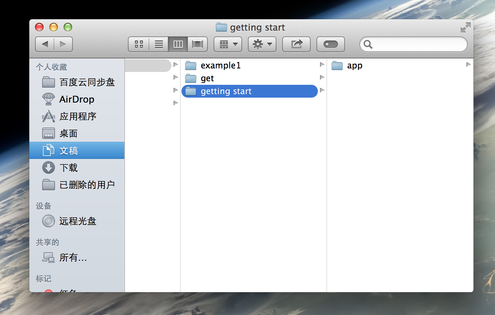

cd到app下,运行:

	$sudo npm install --save express
	
将express安装在此目录下,新建app.js文件:

	var express = require('express');
	var app = express();

	app.get('/',function(req,res){
    	res.send('hello,world');
	});

	app.listen(5000);
	
终端运行:

	$node app.js
	
开启端口，浏览器访问localhost:5000，输出:

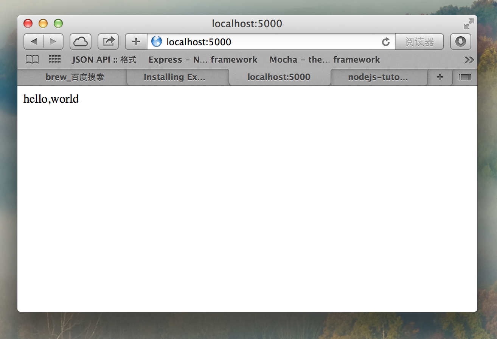


### 如何使用generator

#### 安装

generator是express命令工具集，首先确保已经安装node和npm,先在全局安装这个工具集:
	
	$npm install -g express-generator
	
如果安装失败，尝试加sudo权限:

	$sudo npm install -g express-generator
	
现在新建一个我们的express应用,执行:

	$express expressApp
	
项目创建完毕，文件结构如下:


#### express命令以及参数说明

TODO:by kezhi

#### 安装依赖

打开package.json，可以看到依赖的模块，执行命令来下载依赖的模块:

	$npm install
	
如果下载依赖失败，尝试加sudo权限:

	$sudo npm install
	
下载依赖模块成功后，可以看到在node_modules文件夹下多出了这些模块:

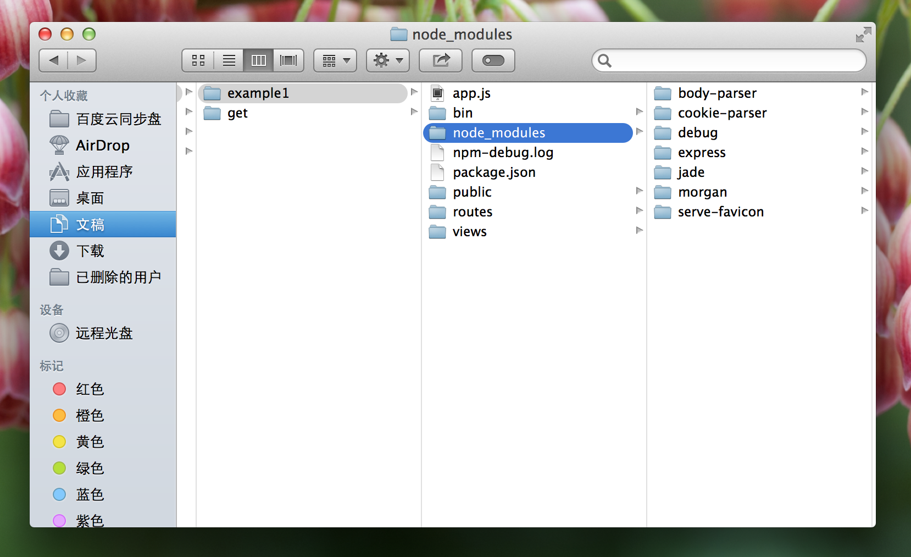

#### 启动服务器

回到app.js层级，执行:

	$npm start

开始运行express打开端口，用浏览器打开http://localhost:3000/，在此估计会出现缺少模块的情况，如果有模块缺少，cd到node_modules文件夹下去安装缺失的模块:

	$sudo npm install xxx(模块名称)

大概会缺失5个模块左右，模块全部安装完成，浏览器则会输出:

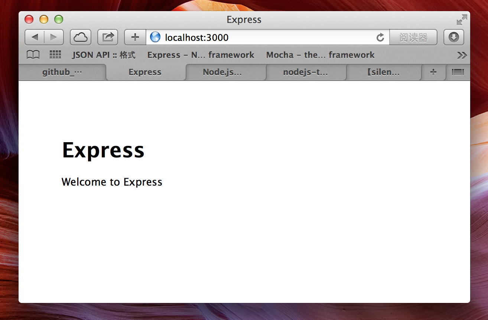

完毕,说明express安装成功.

## 核心概念


### 请求request

Request对象是有关于客户端所发出的请求的对象，只要是有关于客户端请求的信息，都可以藉由它来取得，例如请求标头、请求方法、请求参数、客户端IP，客户端浏览器等等信息。

客户端发来的请求，node.js 帮我们封装成 request 对象

在request里面我们可以获得

- body
- header
- params
- query
- ....

### 响应response

Response对象是有关于对客户端请求之响应，可以利用它来设定一些要响应的讯息，例如标题信息、响应状态码等.

我们利用response,向客户端发送回答，说白了是向浏览器写内容。

### 理解路由

所谓路由就是定义

- 地址1：谁来处理,以什么方式处理
- 地址2：谁来处理,以什么方式处理

```
	var express = require('express');
	var app = express();

	app.get('/',function(req,res){
    	res.send('hello,world');
	});
	
	app.post('/someur',function(req,res){
    	res.send('hello,world');
	});

	app.listen(5000);
```
	
说明一下
例如定义两个路由，一个对应get请求，一个对应post请求；

### session

一个session就是一系列某用户和服务器间的通讯。服务器有能力分辨出不同的用户。

一个session的建立是从一个用户向服务器发第一个请求开始，而以用户显式结束或session超时为结束。
其工作原理是这样的：

1. 当一个用户向服务器发送第一个请求时，服务器为其建立一个session，并为此session创建一个标识号
2. 这个用户随后的所有请求都应包括这个标识号。服务器会校对这个标识号以判断请求属于哪个session
3. 当用户在一段时间没有任何操作，session就会自动超时

这种机制不使用IP作为标识，是因为很多机器是通过代理服务器方式上网，没法区分每一台机器。

对于session标识号（sessionID），有两种方式实现：cookies和URL重写，此处不详细讲解。

#### express的session

nodejs本身不管session，因为用了express框架，express基于connect，connect中有session管理的能力。connect是插件式架构，它的插件称之为“中间件”，其中有个中间件就是叫作session。

到了4.xx版本之后，session管理和cookies等许多模块都不再直接包含在express中，而是需要单独下载添加。


https://github.com/expressjs/session

#### 应用场景: 登陆

- 在登陆页面完成用户鉴权，鉴权成功后，在session里存储用户信息
- 一段时间没有任何操作，session就会自动超时，此时用户点击页面的时候，后台会判断是否存在当前用户的session
- 一半超时会重定向到登陆界面，提示此操作需要用户登陆

#### 应用场景: 购物车

- 保证当前session里有用户信息，用户是登陆状态的
- 用户在购物页面操作，点击加入购物车，此时在session里增加一条信息，存储当前物品信息
- 用户结算的时候，从session获取物品价格和数量，计算出总价，订单完成后，清理session

### 理解模板jade
- http://jade-lang.com/

还有handlebars

以及如何用生成器指定模板

### 理解public目录

- 常规做法

app.js里

	app.use(express.static(path.join(__dirname, 'public')));
	
它就是用来托管public中得所有文件。可以以http方式访问

说明

####如果public/index.html不存在

此时如何使用其他页面做为入口，需要再`/`路由定义处，redirect到对应页面(by kezhi)。

#### 如何在静态页面处理请求参数

在静态页面处理请求参数，是通过连接地址把参数传递过去，通过前端jacascript取出做处理(by kezhi)。


#### 理解express.static

说明http-server用法

区分express.static和http-server的差别：功能一样，用法上有差异

#### 路由冲突

当`public/index.html`和路由的`/`冲突

此时按照`public/index.html`走


## 任务

此处开始是大家每个人都必须亲手做的练习

1. 准备工作
1. 路由定制方式
1. 如何处理get请求
1. 如何处理post请求
1. 如何实现文件上传
1. request里如何取值
1. response返回
1. 完成api返回
1. 完成登陆
1. 完成购物车

### 准备工作

安装supervisor(by kezhi)


### 路由定制方式
路由定制方式有2种

- 常规做法
- 使用路由重定向

#### 常规定义路由

	var express = require('express');
	var app = express();

	app.get('/',function(req,res){
    	res.send('hello,world');
	});
	
	app.post('/someur',function(req,res){
    	res.send('hello,world');
	});

	app.listen(5000);
	
定义了2个请求

- /
- /someurl


#### 使用路由重定向

in app.js

```
var routes = require('./routes/index');
var users = require('./routes/users');

app.use('/', routes);
app.use('/users', users);
```

然后in `/routes/index.js`里

```
var express = require('express');
var router = express.Router();

router.get('/get', function(req, res) {
  res.render('index', { title: 'Express' });
});

router.post('/posttapi', function(req, res) {
  res.render('index', { title: 'Express' });
});

module.exports = router;
```

此时的router里可以增加各种请求的方法。

这种写法是模块化写法，可以按照业务或者其他分类组织代码，使代码具有更高的可读性。

### 如何处理get请求

我们可以在一个html文件里向端口发送get请求，首先要在访问http://localhost:3000下，端口能向浏览器输出此html，默认情况下，express是会输出pubblic文件夹下的index.html文件，在没有特别指明的情况下，所以注释掉:

	//app.use('/', routes);
	
这样在get请求的url为'/'时，express会找到pubblic文件夹;我们可以自定义路由:

	//自定义路由
	var myHttpGet = require('./routes/getserver');
	app.use('/getserver', myHttpGet);
	
当get请求的url为/getserver时，express会执行myHttpGet模块，在routes文件夹下实现myHttpGet模块:

	var express = require('express');
	var router = express.Router();

	/* GET http.*/
	router.get('/', function(req, res) {
		res.send(req.query);
	});

	module.exports = router;
	
当我们在html里用ajax向此路由发送get请求时，我们可以取到参数，做一些处理后，用:

	res.send(resJson);
	
返回给ajax对象:

	oGetBtn.onclick = function(){	

		 $.ajax({
	         type: "GET",
	         url: "http://localhost:3000/getserver",
	         data: {
	         	'method':'GET',
	         	'name':'rainBow',
	         	'sex':'man'
	         },
	         dataType: "json",
	         success: function(data){
	            var str = JSON.stringify(data);
				oResBox.innerHTML = str;
	          }
	     });
	};
		
点击GET按钮发送GET请求，并把发出去的参数整理成json格式并返回:

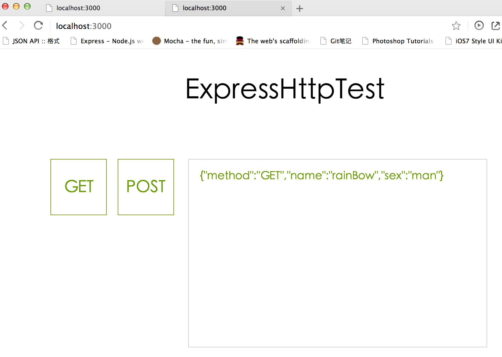
	

### 如何处理post请求

在myHttpGet模块里添加接收此路由下得post请求代码,对于post请求，用req.body接收post参数:

	/* POST http.*/
	router.post('/', function(req, res) {
		res.send(req.body);
	});
	

点击按钮post发送post请求:

	$.ajax({
	     type: "POST",
	     url: "http://localhost:3000/getserver",
	     data: {
	     	'method':'POST',
	     	'name':'rainBow',
	     	'sex':'man'
	     },
	     dataType: "json",
	     success: function(data){
	        var str = JSON.stringify(data);
			oResBox.innerHTML = str;
	      }
	 });
	         
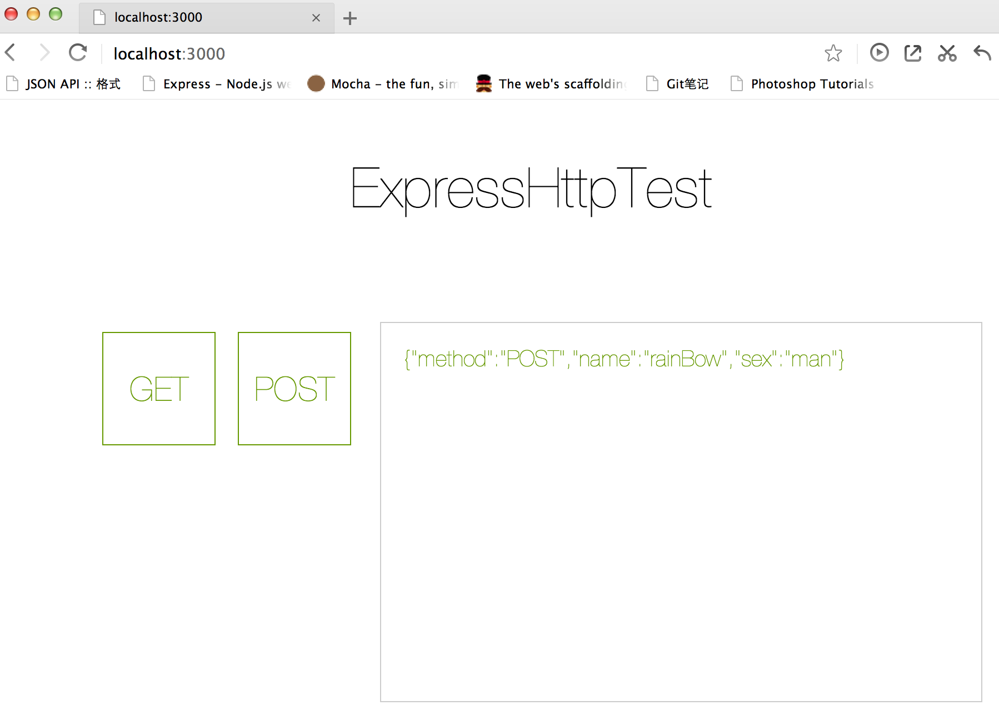

更多，带有参数的post请求

	router.post('/post/:id', function(req, res) {
		res.status(200).json({
			data:{
				id:req.param('id'),
				name:'sss',
				kkk:req.body.kkk
			}
		})
	});

### 如何实现文件上传


### request里如何取值

- body
- params
- query

各自举例

body处理post请求参数，把参数整理成json各式:

	router.post('/', function(req, res) {
		res.send(req.body);
	});
	
query处理get请求参数，整理成json各式:

	router.get('/www:soso', function(req, res) {
		res.send(req.query);
	});

### response返回

- text
- xml
- json

### 完成api返回

### 完成登陆

### 完成购物车


## 实践积累

试着说明package.json的众多方面

#### package.json

package.json是描述项目文件，描述项目所依赖的模块，当我们把一个项目发布到npm时，其实不用把我们所依赖的模块一起发不上去，只需要把依赖的模块名称填写到package.json里面，当别人npm install的时候，npm会去识别package.json中所依赖的模块名称，然后下载下来:

- `npm install --save`  vs `npm install --save-dev`
- `npm start` vs `npm test` (scripts自定义)
- 如何写一个npm，以及发布

当我们通过npm安装某一模块时，运用`npm install --save`或者`npm install --save-dev`，npm则会把我们的项目依赖信息写入package.json中。

#### npm install --save  和 npm install --save-dev的区别:

devDependencies下列出的模块，是我们开发时用的，比如grunt-contrib-uglify，我们用它混淆js文件，它们不会被部署到生产环境。dependencies下的模块，则是我们生产环境中需要的依赖。

#### npm start

新建项目npmStart:

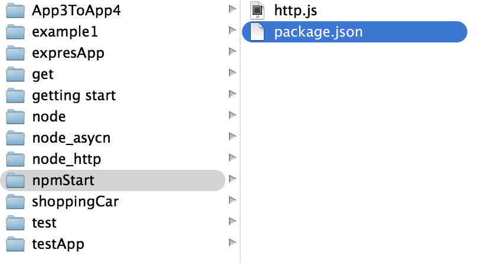

配置package.json中得script参数:

```
{
  "name": "example1",
  "version": "0.0.0",
  "private": true,
  "scripts": {
    "start": "node http.js"
  }
}
```
cd到此目录，运行:

```
$npm start
```
即可运行http.js文件，这就相当于是node http.js的快捷运行方式。

#### npm发布模块

如果需要向npm发布自己的模块，那么需要注册账号密码，终端运行:

```
$npm adduser
```
按照提示填写账号密码邮箱，新建项目，配置package.json文件:

```
{
  "name": "hellonpm",
  "description": "hello world test app",
  "version": "0.0.1",
  "private": false,
  "dependencies": {
    "express": "2.5.9",
    "ejs":"0.4.2",
    "superagent":"0.3.0"
  }
}
```
name即为我们的模块名称，要注意的是private必须设置为false，模块才能被发布，dependencies是指我们的模块需要依赖哪些其他的模块,cd到express文件夹下:

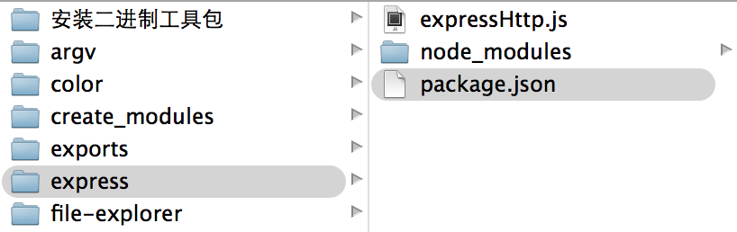

终端运行:

```
$npm publish
```

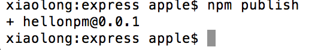

模块发布成功！

cd到任意文件夹运行:

```
$npm install hellonpm
```
即可安装我们上传的hellonpm模块！


## 阅读文档

### getting start

入门文档，如果你看完了上面的内容，就可以不要看了

### guide

此处是开发指南，建议完全看一遍

Error handling

监听server服务错误，如get请求的时候输出一个没定义的变量a，这时express捕捉到错误，并返回'Something broke!':

	app.get('/',function(req,res){
    	res.send(a);
	});

	app.use(function(err, req, res, next){
  		console.error(err.stack);
  		res.status(500).send('Something broke!');
	});

终端输出:

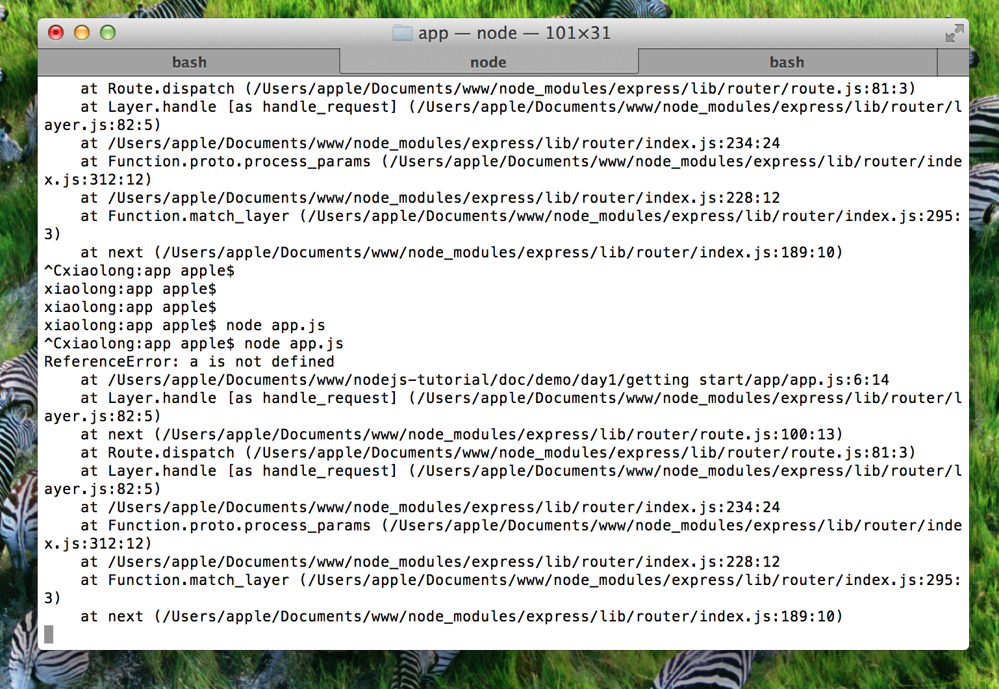

浏览器返回:


Debugging Express

Expressy已经内置了debug模块，如果要用debug运行app.js:

	$DEBUG=express:* node app.js
	
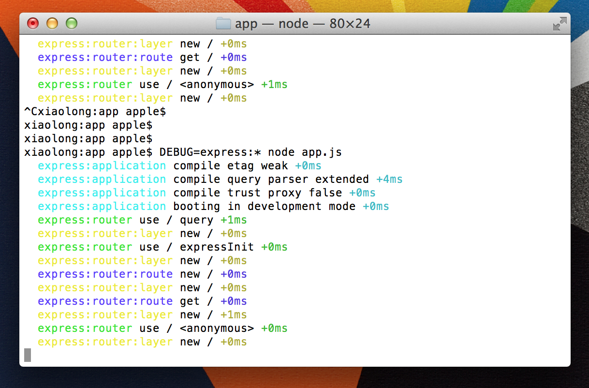

### 知道如何查api文档

中文文档地址 

http://www.expressjs.com.cn

如何在mac下面使用Dash查看离线文档
## 更多

- connect
- express框架源码
- 反向代理（proxy，比如haproxy，nginx）
- 集群部署
- 可以把session存储到redis等缓存中

	```
	// 设置 Session
	app.use(session({
	  store: new RedisStore({
	    host: "127.0.0.1",
	    port: 6379,
	    db: "test_session"
	  }),
	  resave:false,
	  saveUninitialized:false,
	  secret: 'keyboard cat'
	}))
	```
- dsdsds
## 总结


