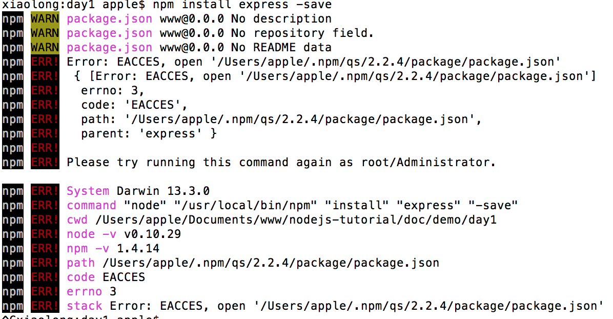
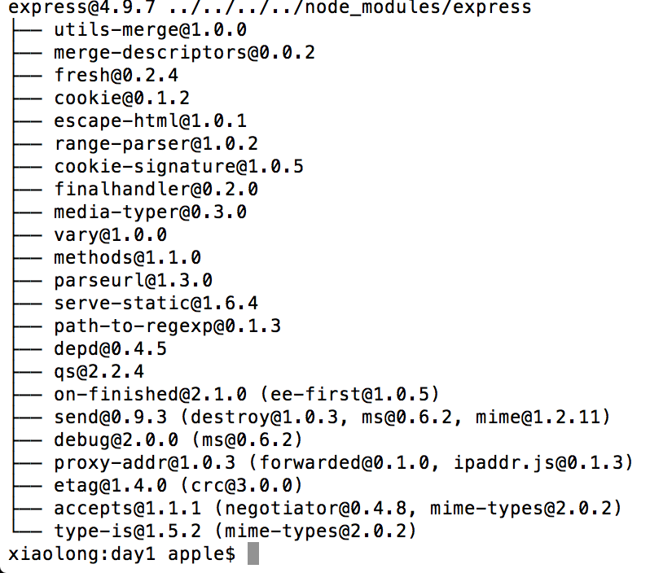

# Express

http://expressjs.com/

## 安装

- 如何安装
- 如何使用generator

generator是express命令工具集，首先确保已经安装node和npm,先在全局安装这个工具集:
	
	$npm install -g express-generator
	
如果安装失败，尝试加sudo权限:

	$sudo npm install -g express-generator
	
现在新建一个文件夹装我们的express应用:

	$mkdir expressApp
	
然后执行:

	$express expressApp
	
项目创建完毕，文件结构如下:

打开package.json，可以看到依赖的模块，执行命令来下载依赖的模块:

	$npm install
	
如果下载依赖失败，尝试加sudo权限:

	$sudo npm install
	
下载依赖模块成功后，可以看到在node_modules文件夹下多出了这些模块:

回到app.js层级，执行:

	$npm start
	
开始运行express打开端口，用浏览器打开http://localhost:3000/，在此估计会出现缺少模块的情况，如果有模块缺少，cd到node_modules文件夹下去安装缺失的模块:

	$sudo npm install xxx(模块名称)

大概会缺失5个模块左右，模块全部安装完成，浏览器则会输出:

完毕,说明express安装成功.

## 阅读文档
### getting start

### guide

### 知道如何查api文档

## 核心概念

### 请求request

### 响应response

### session

## 任务

### 了解http协议

### 如何实现get请求

### 如何实现post请求

### 如何实现文件上传

### request里如何取值

- body
- params
- query

各自举例

### response返回

- text
- xml
- json

## 实践积累

## 总结

