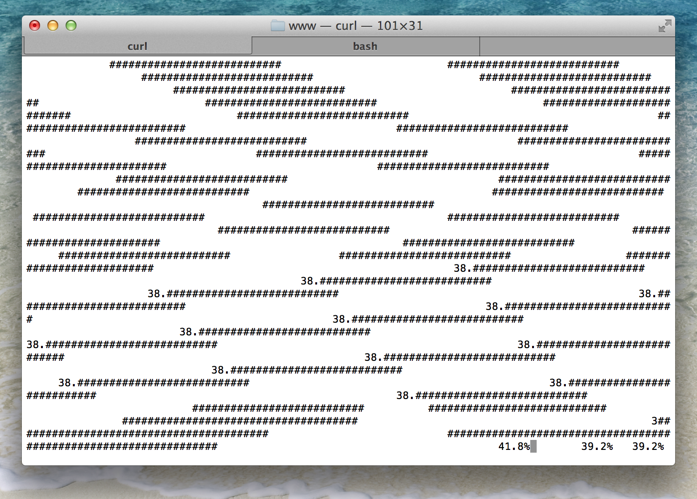
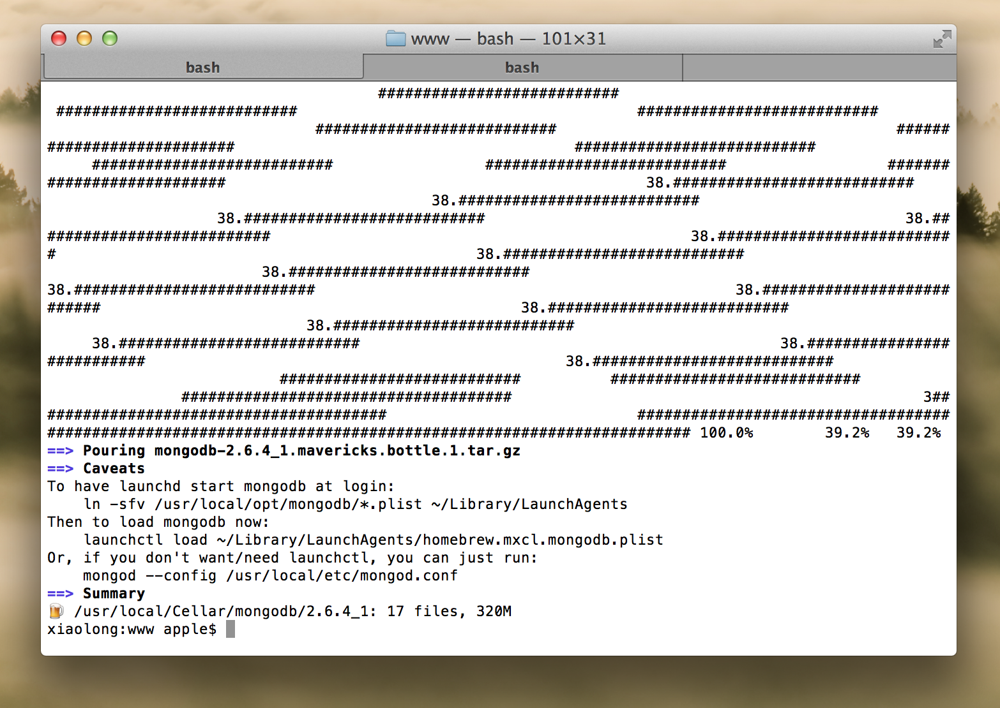

# Mongo DB

http://www.mongodb.org/

## 安装部署

### 方式1

安装brew:
	
	$ruby -e "$(curl -fsSL https://raw.githubusercontent.com/Homebrew/install/master/install)"
	
通过brew安装mongodb:

	$brew install mongodb
	


安装成功:



运行命令:

	$mongod --version
	


不推荐

### 方式2

http://www.mongodb.org/downloads

下载最新的mongodb，比如mac目前最新的是mongodb-osx-x86_64-2.6.5.tgz

将下载的压缩包，解压到/Users/sang/bin/下面

配置环境变量，比如我的zsh配置到`~/.zshrc`里

	export PATH=/Users/sang/bin/mongodb-osx-x86_64-2.6.4/bin:$PATH
	
## 启动服务器

create  startmongo.sh

```
	#! /bin/bash
	mkdir -p ./data/mongodb
	mongod --dbpath ./data/mongodb  --logpath ./mongodb.log &
```

说明

- mongod是mongo deamon的意思，启动服务器
- `--dbpath`是数据存储位置
- `--logpath`是日志存储位置

执行

	./startmongo.sh
	
查看日志

	tail -f ./mongodb.log

## 熟悉命令

### 练习
在线练习

	http://try.mongodb.org/
	
本地

	➜  ~  mongo
	MongoDB shell version: 2.6.4
	connecting to: test
	Server has startup warnings: 
	2014-10-12T15:15:30.180+0800 [initandlisten] 
	2014-10-12T15:15:30.180+0800 [initandlisten] ** WARNING: soft rlimits too low. Number of files is 256, should be at least 1000
	> 

### 连接 

打开命令窗口，键入mongo，如果系统提示：connecting to: test，表示连接成功。 

### 查看所有库 
键入show dbs,则会显示出当前数据库中所有的数据库名称。在mongodb里面是不用 
去手动建立一个数据库的，你只要直接使用就好，如果不存在数据库引擎会帮我们 
创建他们。这一点与传统数据库相比有些不同。 

### 使用mydb 
键入use mydb，使用数据库mydb，当然 
mongodb会帮助我们自动创建他们，当然这个时候数据库还是空的，可以通过输入 
show dbs来确认这一点。 

### 新增记录 

输入：

	db.user.save({name:'Rod',age:30})  


### 查看集合当中所有文档 

	db.user.find()

可查看出当前库user集合中所有的文档，如下所示：

	{ "_id" : ObjectId("4df2201ac905b4e2a5f555cb"), "name" : "Rod", "age" : 30 } 

此时发现，在文档的前面多了一列"_id"，这是自动加进去的，不用管他。 

### 删除记录 

db.user.remove()将删除所有记录，

	db.user.remove({name:'Rod'})
	
将删除指定记录 

### 保存多条记录 
输入：

	for(var i=1;i<=20;i++) db.user.save({x:8,y:i})  
	
，可以看出整个语法很像 
JS，其实你正在使用的就是一个JavaScript Shell。此时可以输入db.user.find() 
来查看所有记录。 

### 迭代器的使用 
我们再向集合中插入一条记录：

	db.user.save({x:'test'})
	
，再次查看所有记录 
	
	db.user.find()
	
则发现只显示出了前20条记录。此时可以输入it（iteraor）来 
查看余下的记录。 

在mongodb里可以将cursor当成数组来使用，如下所示： 

```
var cursor = db.user.find(); // 将游标缓存起来  
printjson(cursor[4]); // 打印出第5条记录  
```

注意此种方式会将前N行全查出来，所以对性能有较大影响。 

### 根据条件查询 
现要查询出y大于10的所有记录： 

	db.user.find({y:{$gt:10}});  


其中$gt的意思就是“大于”，当然读者可推出其他N种表达。 

### 查询指定列 

	db.user.find({x:8},{y:true});// 查询出x=8的所有记录的y列  
  db.user.find({},{y:true}); // 查询出所有的Y列  

### 只查第一列 
有的时候我们只需要第一行的值，如果自己编程实现显得有些麻烦，因此数据库为我们 
提供了一个方法：

	db.user.findOne(); 

### 限制最大记录从而提高性能 
我们可以通过limit来限制查询的最大行数，如下： 

	db.user.find().limit(4); // 只显示出前四条 

### 修改记录 

将第一条x为3的记录修改为后面的值，
	
	db.user.update({x:4},{x:4,y:1}); 

## 文档

增删改查crud

http://docs.mongodb.org/manual/core/crud-introduction/

 

## 了解node如何调用mongodb


## 了解mongoose（ORM）用法
http://mongoosejs.com/docs/

http://www.tuicool.com/articles/ZVbYra
## 高级

- gridfs
- 集群
## 总结


